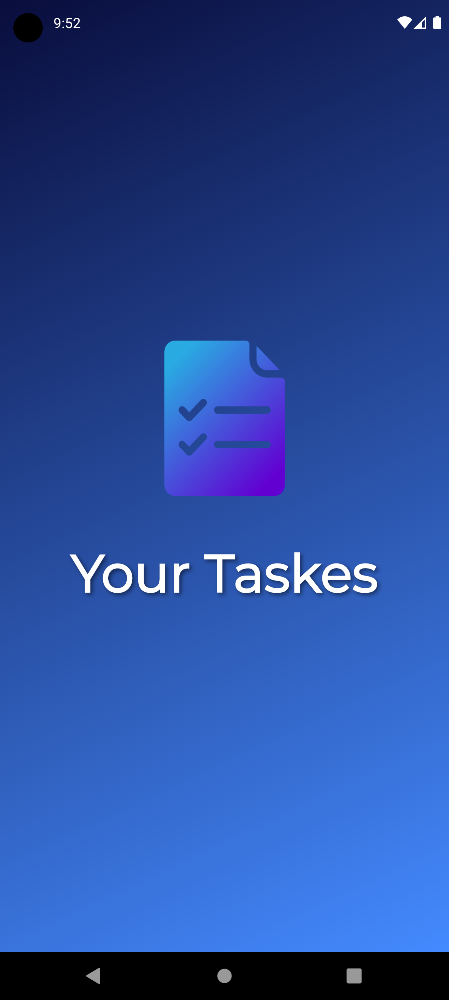
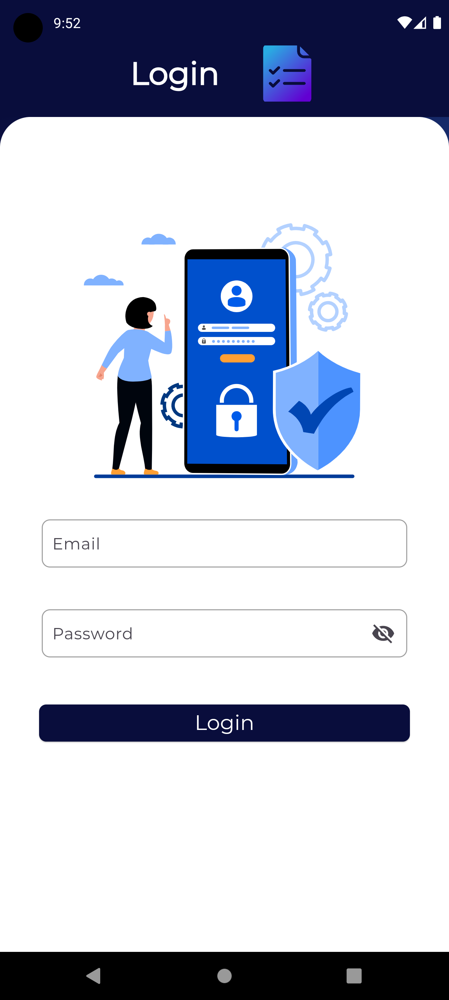
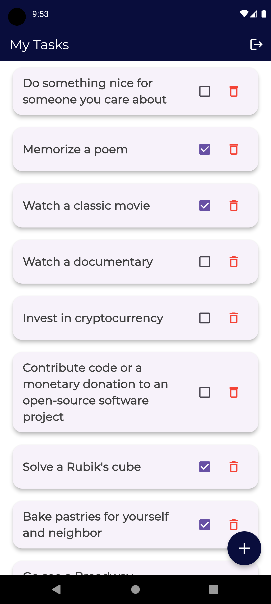

# Task Management App

This Flutter-based application is designed to handle task management with features like authentication, task creation, pagination, local storage, and unit testing. It is built with modern Flutter tools, state management via `flutter_bloc`, and seamless UI/UX with animations and responsive layouts. This document will walk you through the core features, functionality, and the libraries used.

## Table of Contents

- [Features](#features)
  - [Authentication](#authentication)
  - [Pagination](#pagination)
  - [Task Management](#task-management)
  - [Local Storage](#local-storage)
  - [UI Enhancements](#ui-enhancements)
  - [Animations](#animations)
  - [Unit Testing](#unit-testing)
- [Screenshots](#screenshots)    
- [Packages](#packages)
- [Installation](#installation)
- [Usage](#usage)
- [Testing](#testing)

---

## Features

### Authentication
The app includes a complete authentication system where users can sign in and sign up using email and password. User sessions are managed using `shared_preferences` for local storage, ensuring users remain logged in across app sessions.

- **Login**: Validates credentials and logs in users.
- **Signup**: Registers new users and stores their data.
- **Persistent Login**: User session persists using local storage (`shared_preferences`).

### Pagination
The app supports pagination for task listings, ensuring smooth scrolling and performance even with large datasets. This is particularly useful for task management where users may have a large number of tasks.

- **Efficient Data Loading**: Tasks are loaded page by page to reduce memory usage.
- **Scroll to Load More**: Additional tasks load automatically when the user reaches the end of the list.

### Task Management
The app allows users to create, update, and delete tasks. Users can easily manage their to-dos, mark tasks as complete, and categorize tasks.

- **Create Tasks**: Users can add new tasks with descriptions and deadlines.
- **Update Tasks**: Modify existing tasks as priorities or details change.
- **Delete Tasks**: Remove completed or irrelevant tasks.

### Local Storage
Local storage is managed through `shared_preferences` to store essential user data such as authentication tokens, user preferences, and task data when offline.

- **Persistent Storage**: Store user settings and other data locally.
- **Offline Support**: Basic task functionality even without an active internet connection.

### UI Enhancements
The app's UI is carefully crafted with modern UI principles using Flutter's layout system and tools such as `flutter_screenutil` for responsive design. Custom animations and transitions make the app smooth and visually appealing.

- **Custom Buttons**: Styled buttons for a consistent look.
- **Responsive Layouts**: Adapts to different screen sizes using `flutter_screenutil`.
- **Theming**: Consistent use of colors and typography throughout the app.

### Animations
Animations are used across the app to enhance user experience. Using the `flutter_animate` package, smooth animations for transitions, button presses, and task interactions are added.

- **Splash Screen Animations**: Animated logo and text on the splash screen.
- **Fade and Scale Effects**: Subtle animations for various screen elements.
- **Button Animations**: Interactive button presses and hover effects.

### Unit Testing
The app includes a range of unit tests for verifying core functionality. Testing is an important part of the app’s lifecycle, ensuring that the authentication logic, task management, and pagination work as expected.

- **Bloc Tests**: Ensures correct behavior of state management (Cubit/BLoC).
- **Repository Tests**: Validates the interaction between the app and external APIs.

---

## Screenshots

### Splash Screen


### Login


### Task List 



---
## Packages

The app uses several Dart and Flutter packages to handle different functionalities:

| Package                    | Version   | Description                                                     |
|----------------------------|-----------|-----------------------------------------------------------------|
| `cupertino_icons`           | ^1.0.6    | Provides iOS-style icons for Flutter apps.                       |
| `flutter_bloc`              | ^8.1.6    | Manages state using the BLoC pattern.                           |
| `logger`                    | ^2.4.0    | Logs important app events and errors.                           |
| `dio`                       | ^5.7.0    | A powerful HTTP client for API calls.                           |
| `dartz`                     | ^0.10.1   | Functional programming library for handling data types.         |
| `flutter_screenutil`        | ^5.9.3    | Helps with responsive design across different screen sizes.     |
| `shared_preferences`        | ^2.3.2    | Provides local storage for storing simple data.                 |
| `go_router`                 | ^14.3.0   | A routing library for navigation between app screens.           |
| `top_snackbar_flutter`      | ^3.1.0    | Displays custom snack bars at the top of the screen.            |
| `get_it`                    | ^8.0.0    | A dependency injection framework for managing service locators. |
| `flutter_svg`               | ^2.0.10+1 | Allows rendering of SVG images.                                 |
| `skeletonizer`              | ^1.4.2    | Creates skeleton loaders for improved loading states.           |
| `connectivity_plus`         | ^6.0.5    | Monitors the device’s internet connection status.               |
| `flutter_animate`           | ^4.5.0    | Provides smooth and customizable animations.                    |

---

## Installation

1. **Clone the repository**:
   ```bash
   git clone https://github.com/algzery-ahmed/task-management-app.git
   cd task-management-app
   ```

2. **Install the dependencies**:
   ```bash
   flutter pub get
   ```

3. **Run the app**:
   ```bash
   flutter run
   ```

---

## Usage

- **Authentication**: Sign up or log in with email and password.
- **Task Management**: Create, update, or delete tasks from the main task list.
- **Pagination**: Scroll through the task list, which loads more tasks as you reach the end.
- 
---

## Testing

To run the unit tests for this app, use the following command:

```bash
flutter test
```

This will execute all the tests for state management, repository classes, and core app functionality.

---

## Conclusion

This task management app demonstrates using modern Flutter tools like `flutter_bloc` for state management, `dio` for API calls, and `flutter_animate` for creating fluid animations. With features like authentication, pagination, task creation, and local storage, it provides a smooth user experience for managing tasks efficiently.

Feel free to contribute by submitting pull requests or reporting issues!

---
